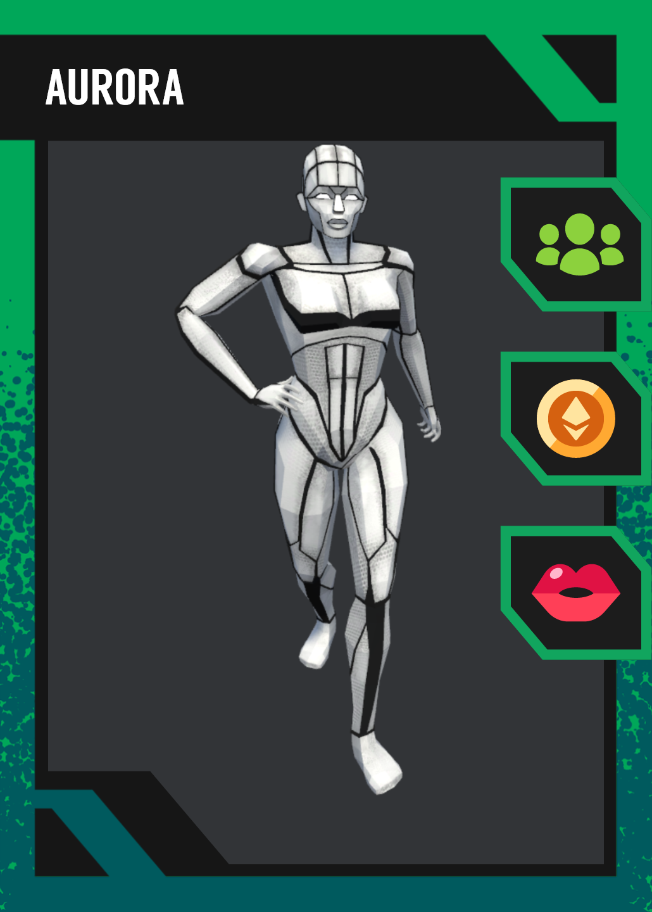
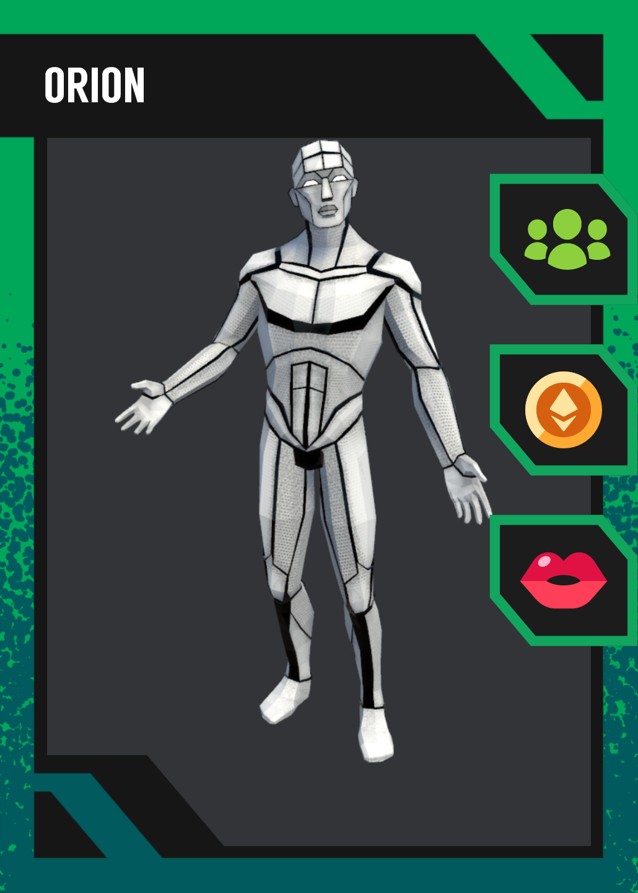
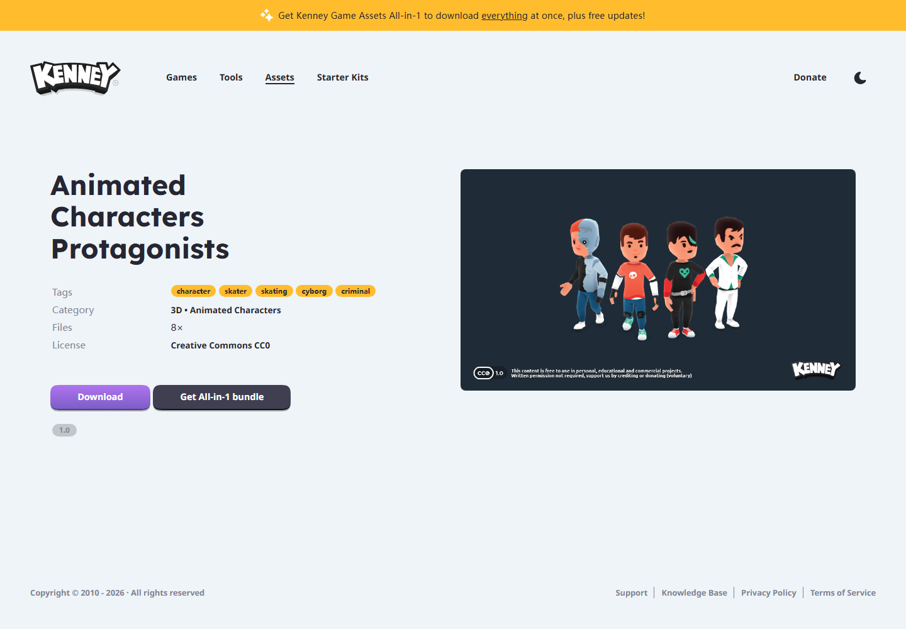
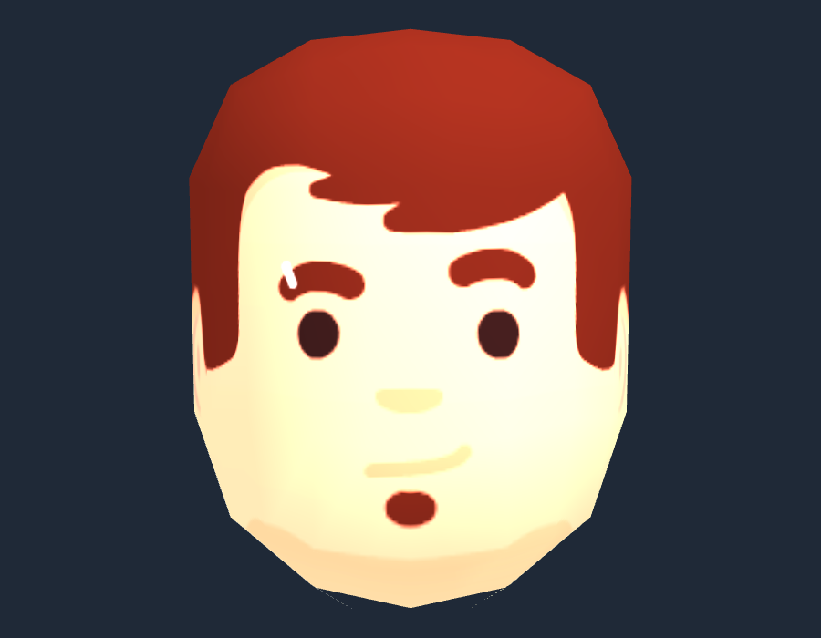
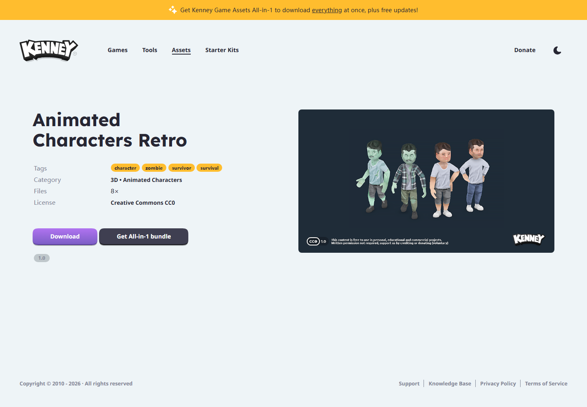
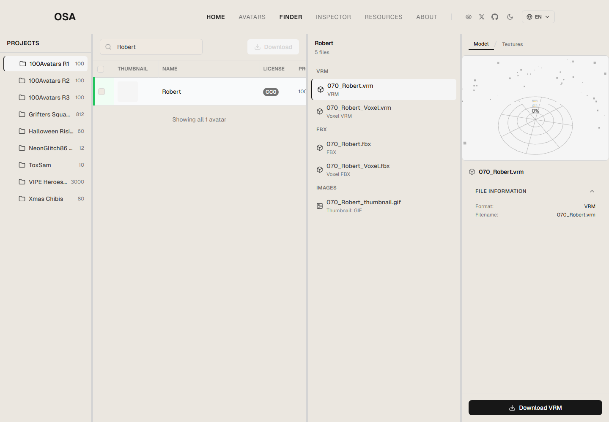
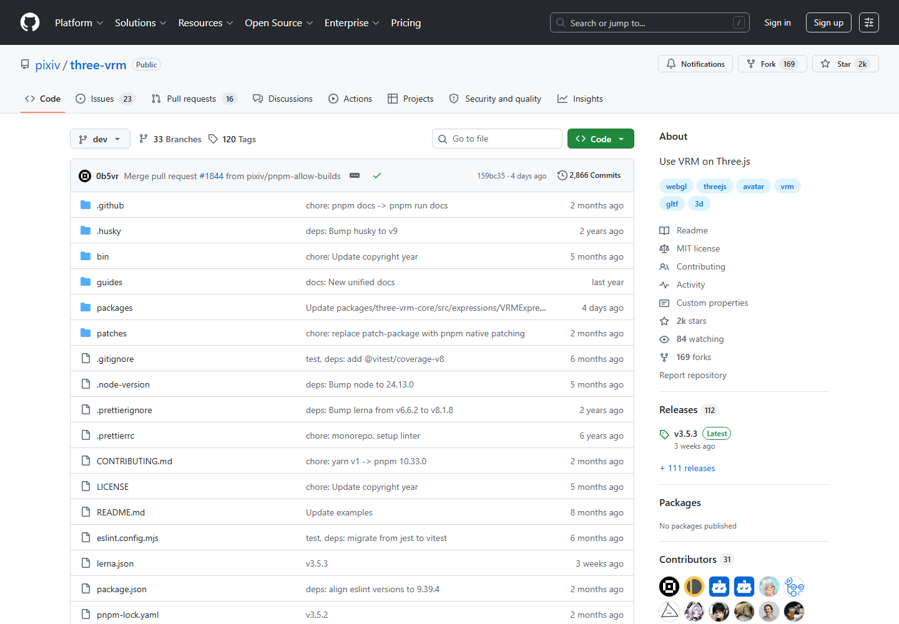
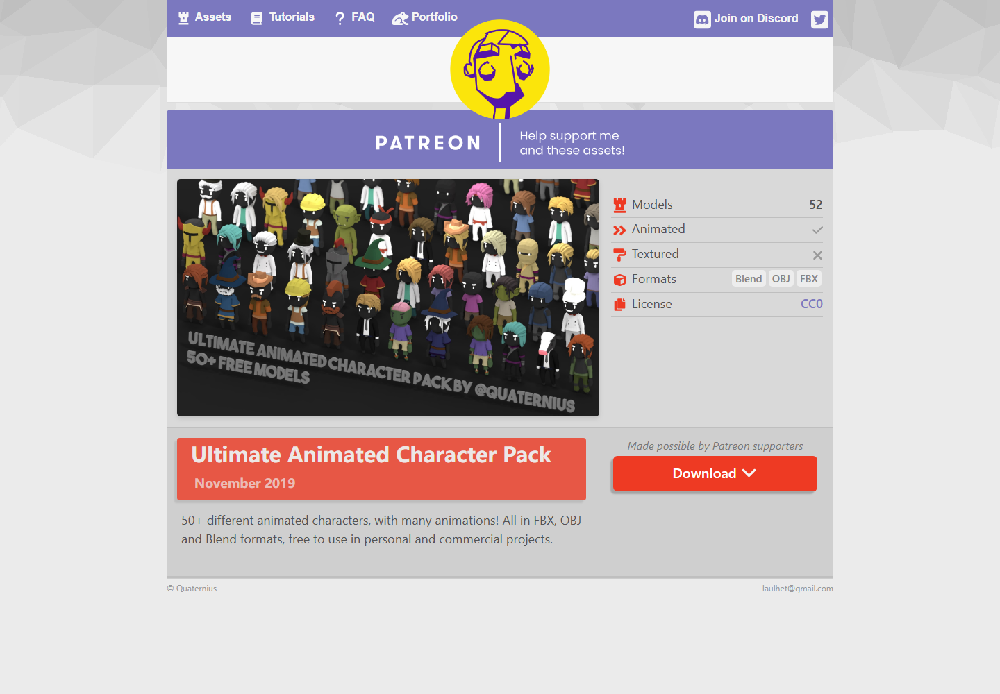

# Open-Source Avatar Candidate Screenshots

This folder collects visual references for the next avatar upgrade branch.

## Priority 1: ToxSam VRM Candidates

These are VRM models with stable thumbnail access in the current environment. They look more finished than the current procedural head, but the visual direction is sci-fi / anonymous substitute rather than warm Memoji-style avatar.

## Priority 2: Kenney CC0 Character Packs

Kenney assets have very clear CC0 licensing and low integration risk. Candidate C, `Animated Characters Protagonists`,
was selected for the current feature branch. The runtime now uses an extracted GLB head-only mesh from this pack as the
primary male/female digital substitute.

## Fallback / Research References

Open Source Avatars is still the best registry to continue searching because it exposes VRM/glTF-oriented avatar entries and license metadata. In this environment, Arweave and some IPFS thumbnail gateways timed out, so Robert/Rose could not be captured as direct preview images yet.

`pixiv/three-vrm` is a runtime reference, not a direct visual asset source. It is relevant if the next branch upgrades the renderer to first-class VRM loading.

Quaternius is CC0 and easy to use, but the visual style is lower-poly and less suitable as the main privacy substitute.

