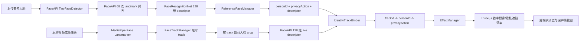

# PersonaShield 身份感知隐私动作绑定技术路线

## 目标

PersonaShield 的核心改进是把原来的多人脸娱乐 AR 特效流程，升级为“按注册身份执行隐私策略”的视频隐私防护流程：

1. 被拍摄者上传参考人脸图像，注册一个受保护身份。
2. 被拍摄者为该身份选择隐私动作，例如允许真实出镜、男性数字替身、女性数字替身或隐私遮挡。
3. 系统从参考图中提取本地人脸识别 descriptor，并保存 `{personId, name, privacyAction, descriptor}`。
4. 摄像头或本地视频运行时，MediaPipe 检测多人脸，`FaceTrackManager` 维护短时稳定的 `trackId`。
5. `IdentityTrackBinder` 只对新 track、未知 track 或过期 track 做低频身份识别。
6. 匹配成功后建立 `trackId -> personId -> privacyAction`。
7. `EffectManager` 优先使用身份隐私动作，再考虑手动点击绑定和默认 fallback。

当前 MVP 采用中心化/本地注册表思路：所有参考身份和隐私偏好保存在浏览器前端状态中，用于课程演示和技术验证。DID、链上声明、可信执行环境和厂商级合规协议暂作为远期方向，不纳入本次实现范围。

## 方案调研结论

本轮实现比较了三条路线：

| 方案 | 优点 | 风险 | 结论 |
| --- | --- | --- | --- |
| MediaPipe Face Landmarker | 当前项目已经使用，速度快，适合 landmarks、姿态估计和 AR 锚点 | 官方不提供身份识别 embedding，只能做人脸检测和关键点 | 继续用于多人脸检测、追踪和渲染锚点 |
| `@vladmandic/face-api` | MIT；浏览器端可用；npm 包包含预训练模型；支持 128 维 face descriptor | 精度低于 ArcFace/InsightFace，但工程风险低，适合一周内完成 | 当前落地方案 |
| ArcFace/InsightFace + ONNX Runtime Web | 识别精度和技术深挖价值更高 | 需要脸部对齐、ONNX 预处理、模型体积和性能调优 | 后续升级方向 |

最终选择 `@vladmandic/face-api@1.7.15` 作为 MVP 身份识别组件。它是维护版 face-api，支持浏览器端人脸检测、landmark、128 维人脸描述子和人脸匹配，并且模型权重可本地托管，符合“不调用云端人脸 API”的项目边界。

## 当前实现

- `vendor/face-api/dist/face-api.esm.js`
  - 本地保存 FaceAPI 浏览器端 ESM bundle，不依赖 CDN。

- `vendor/face-api/model/`
  - 保存 `tiny_face_detector`、`face_landmark_68_tiny` 和 `face_recognition` 三组模型权重。

- `src/FaceApiIdentityRecognizer.js`
  - 注册参考头像时，调用 FaceAPI 检测人脸并提取 128 维 descriptor。
  - 实时视频中，根据 MediaPipe track 的 bounds 裁剪人脸区域，再低频提取 live descriptor。
  - 使用欧氏距离、匹配阈值和最佳/次佳距离差判断是否属于注册人物。
  - provider 标记为 `face-api-face-recognition-net`。

- `src/ReferenceFaceManager.js`
  - 保存注册身份、参考头像、隐私动作、avatar 类型和 descriptor。
  - `effectId` 作为内部兼容字段保留，但语义已经变为 `privacyAction`。

- `src/IdentityTrackBinder.js`
  - 支持异步识别任务。
  - 识别中显示 `recognizing`，匹配成功后才建立身份绑定。
  - 匹配失败或低于阈值时不绑定隐私动作，避免陌生参考图被误贴到任意人脸。
  - 已绑定 track 通过短时追踪保持身份，不每帧重复识别。

- `src/EffectFactory.js`
  - 新增 `Allow real appearance`、`Male digital substitute`、`Female digital substitute` 和 `Privacy blur shield` 四类隐私动作。
  - 旧 Jeeliz 娱乐特效保留为 legacy/fallback 资产，不再作为主界面选择项。

- `src/EffectManager.js`
  - 优先级为 identity privacy binding -> manual track binding -> manual slot binding -> automatic fallback。

- `src/UIController.js`
  - 展示注册人物、参考头像、隐私动作、识别状态、匹配距离和受保护帧下载入口。

## 数据流

## 为什么使用“MediaPipe 检测追踪 + FaceAPI 低频识别”

MediaPipe Face Landmarker 的优势是实时检测、关键点和姿态估计，适合多人脸 AR 锚定；FaceAPI 的优势是提供可本地运行的人脸识别 descriptor。两者组合后可以兼顾实时性和身份正确性：

1. MediaPipe 周期性检测 2-4 张人脸并输出关键点。
2. `FaceTrackManager` 维护短时稳定 track，减少检测槽位变化带来的闪烁。
3. FaceAPI 只在新 track 或身份不确定时做人脸识别，不进入每帧高成本推理。
4. 匹配成功后，后续帧主要复用 `trackId -> personId` 绑定。
5. track 丢失、参考人物修改或绑定重置后再重新识别。

这条路线比单纯 landmark 几何匹配更能满足“注册 A 的照片，只在 A 出现时执行 A 的隐私动作”的目标，同时仍能保持多人脸实时渲染流畅。

## 当前验收结果

`npm run verify:identity-binding`：

- 注册 `Person A` 和 `Person B` 两张参考头像。
- 两人 descriptor provider 均为 `face-api-face-recognition-net`。
- descriptor 长度均为 128。
- `Person A -> avatarMale`，距离 0.0910。
- `Person B -> avatarFemale`，距离 0.0638。
- 活动 track 数：4。
- 身份绑定 track 数：2。
- FPS：59。
- 可视化截图：`docs/verification-personashield-identity-binding.png`。
- 受保护帧截图：`docs/verification-personashield-protected-frame.png`。

`npm run verify:identity-negative`：

- 从另一张候选图片中裁剪陌生人参考图并注册为 `Stranger -> privacyBlur`。
- descriptor provider 为 `face-api-face-recognition-net`，长度 128。
- 当前 `partyHats4` 视频中有 4 个活动 track。
- 身份绑定 track 数：0。
- 4 个活动 track 的距离范围约 0.7378-0.9144，高于阈值 0.5，因此拒绝绑定。
- 可视化截图：`docs/verification-personashield-negative.png`。
- 陌生参考图：`docs/verification-stranger-reference.png`。

## 已知限制

- FaceAPI 是身份匹配组件，不是法律意义上的身份认证系统，不能用于门禁、安全支付等高风险场景。
- 单张参考图对姿态、光照和清晰度仍然敏感。
- 小脸、强侧脸、严重遮挡时可能无法提取 descriptor，系统会保持未绑定状态。
- 当前识别任务仍在主线程执行，首次加载模型和首次注册会较慢。
- 当前中心化/本地注册表只验证技术闭环，没有解决跨设备信任和厂商强制执行问题。

## 后续升级

1. 支持每个人上传多张参考图，使用多 descriptor 平均或最近邻匹配。
2. 将 FaceAPI 推理迁移到 Web Worker，减少对 UI 主线程的影响。
3. 增加阈值校准集，输出正负样本距离分布。
4. 后续替换为 InsightFace/AdaFace/EdgeFace ONNX Runtime Web，提高跨姿态和跨光照识别能力。
5. 扩展受保护视频录制，而不仅是保护帧截图。
6. 将当前本地注册表抽象为可替换的中心化身份服务接口，便于后续讨论平台化或协议化方案。
