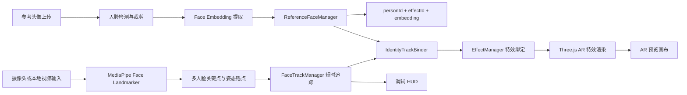
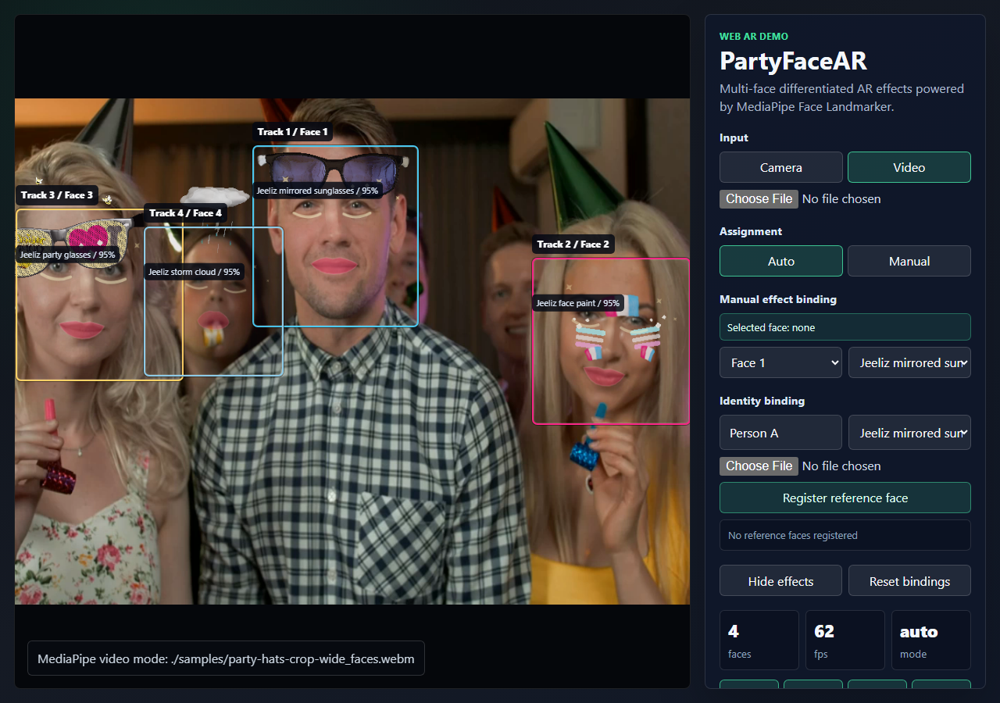
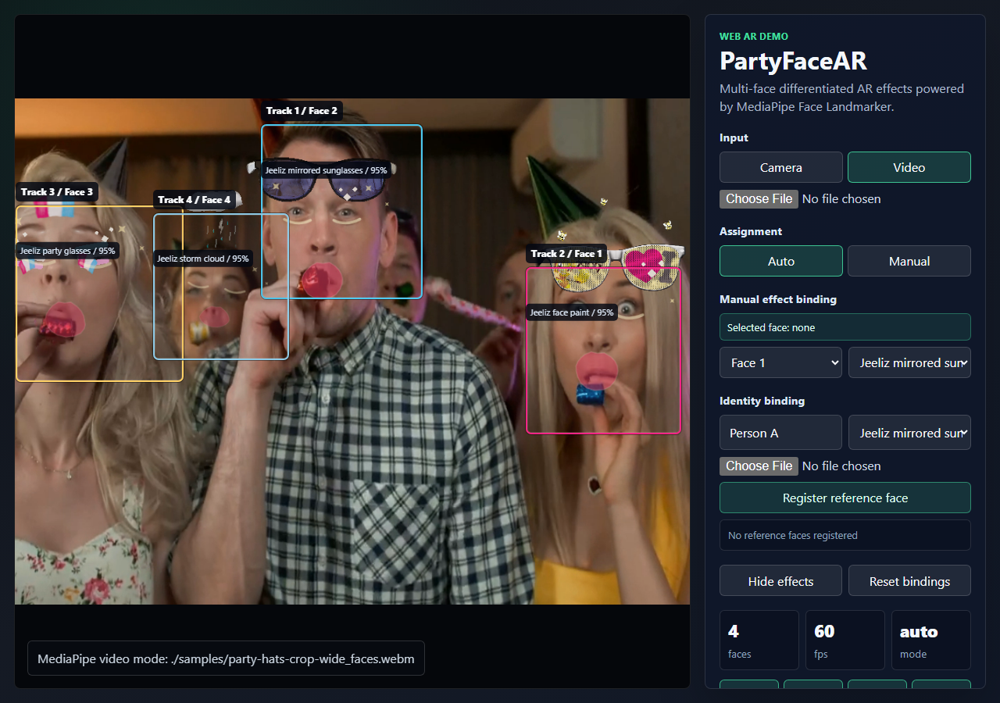
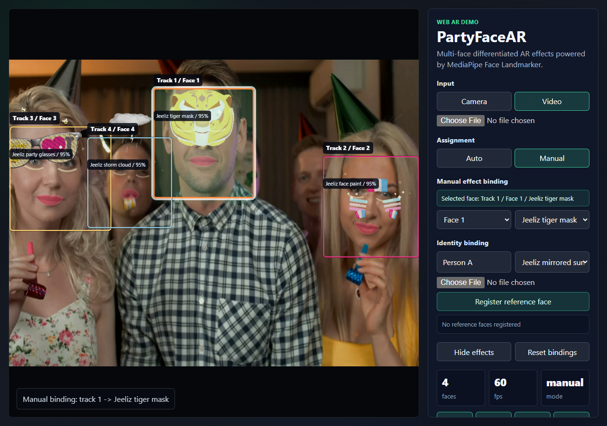
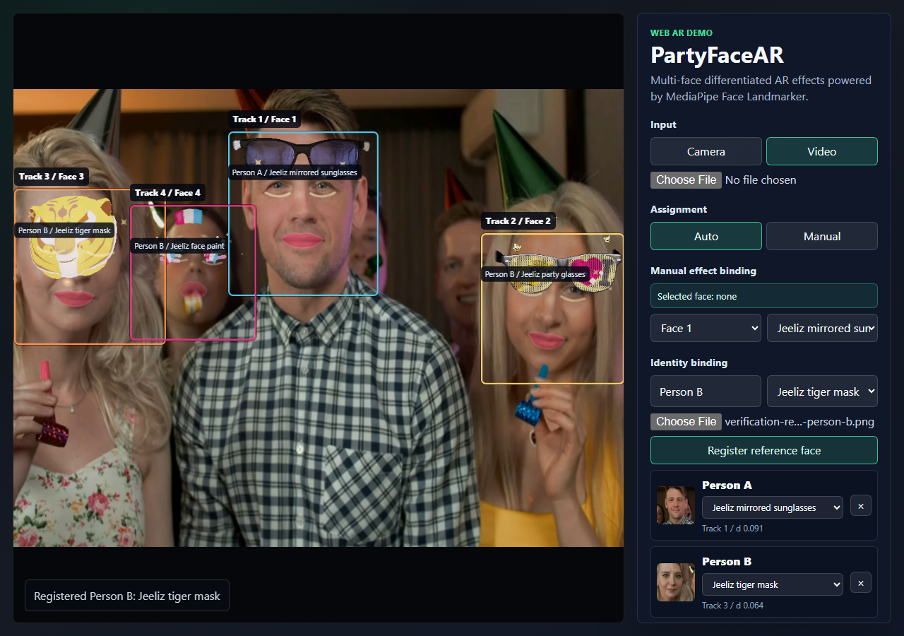
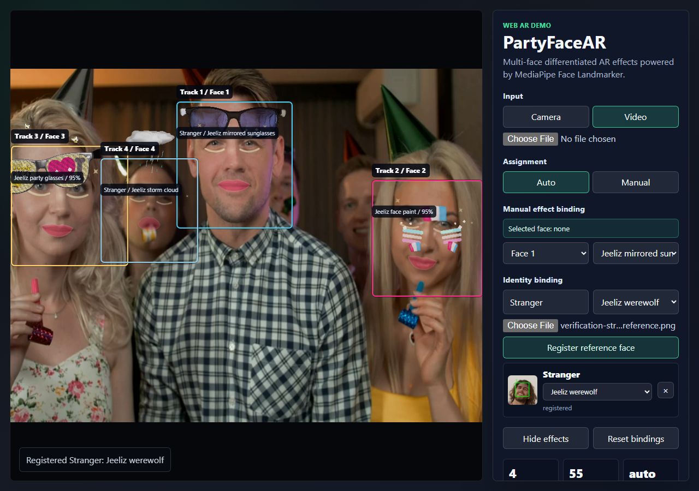

# PartyFaceAR 中文报告框架

## 1. 项目背景

AR 眼镜适合承载共享式社交体验：同一个物理空间中的多名参与者，可以在彼此脸上看到不同的虚拟特效。PartyFaceAR 的最终目标不是简单给检测到的第 1、2、3 张脸随机加特效，而是支持“参考头像身份绑定”：用户先上传人物 A、人物 B 的脸部参考图，并分别选择对应特效；系统在摄像头或本地视频中检测多人脸，当 A 或 B 出现时，自动为其叠加预先选择好的特效。

本项目不依赖公网部署，不需要后端服务器、数据库或实时通信服务。课程演示阶段采用本地静态网页运行方式，通过 `python -m http.server 8000` 启动后，在 PC Chrome 中访问本地页面即可。

## 2. 问题定义

给定若干参考头像和一段摄像头/视频输入，系统需要完成以下目标：

1. 用户注册 1-3 个目标人物，每个人提供至少 1 张脸部参考图。
2. 用户为每个已注册人物选择一个 AR 特效，例如 A 绑定墨镜，B 绑定老虎面具。
3. 系统从参考图中提取人脸描述子，并保存 `{personId, effectId, embedding}`。
4. 在摄像头或视频中检测 2-4 张人脸，并为每张活动人脸维护短时稳定的 `trackId`。
5. 当新 track 出现或 track 身份不确定时，对该 track 的人脸区域进行身份匹配。
6. 如果匹配到已注册人物，则建立 `personId -> trackId -> effectId` 绑定，并渲染该人物对应的特效。
7. 后续帧主要依靠 track 追踪保持稳定，不在每一帧重复进行高成本识别。

当前阶段已经完成多人脸检测、短时追踪、不同特效渲染、点击选脸、track 级手动绑定，以及参考头像身份绑定 MVP。核心改进是加入参考头像注册、descriptor 匹配和身份到 track 的绑定能力，让特效绑定从“当前画面中手动选 track”升级为“根据人物身份自动绑定”。

## 3. 系统架构

系统整体采用纯前端静态网页实现。MediaPipe Face Landmarker 负责人脸检测和关键点输出，`FaceTrackManager` 将逐帧检测结果转换为短时稳定 track。新增的人脸识别模块负责从参考头像和视频 track 中提取 embedding，并通过相似度匹配判断当前 track 是否属于某个已注册人物。匹配成功后，`EffectManager` 根据人物绑定关系渲染对应特效。

## 4. 核心模块

已完成模块：

- `MediaPipeFaceSource`：检测最多 4 张人脸，并将 MediaPipe 输出转换为项目内部的检测状态。
- `FaceTrackManager`：将每帧检测结果关联成短时稳定的 track，处理短暂丢失、恢复和检测槽位变化。
- `UIController`：控制摄像头/视频输入、自动/手动分配、画面点击选脸、Face Slot 选择、重置绑定和调试 HUD。
- `EffectManager`：维护特效列表、自动分配规则、track 级手动绑定规则和特效持久化。
- `EffectFactory`：复用 Jeeliz/WebAR 风格资产，并构建可复用的 Three.js 人脸特效。

新增身份绑定模块：

- `ReferenceFaceManager`：管理注册人物、参考头像、人物名称、绑定特效和 embedding。
- `FaceApiIdentityRecognizer`：基于 `@vladmandic/face-api` 从参考图和视频 track crop 中提取 128 维人脸识别 descriptor，并进行距离匹配。
- `IdentityTrackBinder`：将识别出的 `personId` 绑定到当前 `trackId`，支持异步低频识别，并维护 `trackId -> personId -> effectId` 的映射。
- 身份绑定 UI：提供参考头像上传、人物列表、每个人特效选择和识别状态显示。

## 5. 人脸检测、识别与追踪结合策略

如果每帧都做人脸识别，浏览器端算力压力会较大，也会影响 AR 渲染帧率。因此本项目采用“检测 + 识别 + 追踪”的分层策略：

1. 检测层：使用 MediaPipe Face Landmarker 周期性检测多人脸，输出关键点、姿态和脸部区域。
2. 追踪层：`FaceTrackManager` 根据屏幕位置、脸部尺度和检测槽位维护短时 `trackId`。
3. 识别层：只在新 track 出现、track 丢失后恢复、身份置信度下降或定时复核时执行 embedding 匹配。
4. 绑定层：如果某个 track 匹配到注册人物 A，则将该 track 绑定到 A 的 `personId` 和 A 选择的特效。
5. 渲染层：后续连续帧直接根据 track 绑定关系渲染特效，不重复做高成本识别。

这种设计可以降低实时识别开销，并避免每一帧身份匹配波动造成特效频繁换脸。

## 6. 人脸识别方案选择

本项目最初尝试过只用 MediaPipe landmarks 构造几何 descriptor，但该方案只能比较脸型和五官相对位置，不能可靠判断“是否同一个人”。实测中，如果注册一张视频中不存在的他人照片，仍可能把特效贴到当前用户脸上。因此身份识别核心必须从几何相似度升级为真实人脸 embedding。

本轮调研比较了三条路线：

- MediaPipe Face Landmarker：速度快，适合多人脸检测、468 点关键点、姿态估计和 AR 锚点，但官方不提供身份识别 embedding。
- `@vladmandic/face-api`：维护版 face-api，MIT 协议，浏览器端可用，npm 包包含模型权重，支持 TinyFaceDetector、68 点 landmark 对齐和 128 维 face descriptor。
- ArcFace/InsightFace + ONNX Runtime Web：识别精度更强，但需要处理人脸对齐、ONNX 输入预处理、模型体积和 Web 推理性能，短周期落地风险更高。

最终选择 `@vladmandic/face-api@1.7.15` 作为当前工程级 MVP 的身份识别方案。MediaPipe 继续负责检测、追踪和特效锚点；FaceAPI 只在参考图注册和新 track/未知 track 上低频提取 128 维 descriptor。这样既能修复“陌生参考图误绑定”的核心问题，又能保持多人脸 AR 渲染流畅。

推荐 MVP 验收范围：

- 支持注册 1-3 个目标人物。
- 每个人上传 1 张参考头像。
- 每个人可以选择一个特效。
- 视频中出现已注册人物时，系统能识别并自动绑定对应特效。
- 新 track 识别后，后续帧依靠 track 保持稳定。
- 不要求强侧脸、严重遮挡、长时间跨镜头身份恢复。

## 7. 当前阶段可视化结果

当前阶段已完成多人脸检测、短时追踪、不同特效渲染和画面点击选脸绑定。这些结果是后续身份识别版本的基础。

图 1：暂停帧验证结果。画面中同时检测到 4 张人脸，每张脸叠加了不同的 AR 特效；右侧 HUD 显示 `4 faces`、约 `59 fps`，并列出 `Track X / Slot Y`、特效名称和检测置信度。该图证明系统能够在同一帧中完成多人脸检测和差异化特效渲染。

图 2：实时播放验证结果。画面中保持 4 张活动人脸，右侧 HUD 显示约 `61 fps`，不同人脸仍然显示不同特效。该图证明系统不是静态截图叠加，而是在视频播放过程中保持实时追踪和渲染。

图 3：阶段性手动绑定结果。画面中每张人脸都有可点击选择框，当前选中的 `Track 1 / Face 1` 被高亮显示；右侧面板切换到 `Manual` 模式，并显示 `Selected face: Track 1 / Face 1 / Jeeliz tiger mask`。该功能不是最终身份识别目标，但可以作为身份识别失败时的人工 fallback，也证明 track 级特效绑定已经可用。

演示视频文件：[`party-face-ar-showcase-demo.webm`](./party-face-ar-showcase-demo.webm)

图 4：身份绑定正例结果。系统注册 `Person A` 和 `Person B` 两个参考人物，并分别绑定不同特效；画面中 `Track 1` 被识别为 `Person A` 并叠加墨镜，`Track 3` 被识别为 `Person B` 并叠加老虎面具。右侧列表显示注册人物、参考头像、特效选择和绑定状态。该图证明特效已经从 track 级手动绑定升级为身份级自动绑定。

图 5：身份绑定负例结果。系统注册了来自另一张图片的 `Stranger` 参考头像，并为其选择狼人特效；当前视频中虽然有 4 个活动人脸 track，但身份绑定数为 0，没有任何一张当前人脸被错误绑定到 `Stranger`。该图对应用户提出的“注册他人照片却贴到自己脸上”反例，是本项目新增的关键回归测试。

## 8. 新目标验收标准

身份绑定版本验收标准：

1. 可以上传人物 A 的参考头像，并为 A 选择墨镜等特效。
2. 可以上传人物 B 的参考头像，并为 B 选择另一个特效。
3. 启动本地视频或摄像头后，如果画面中出现 A，系统自动为 A 加载 A 的特效。
4. 如果画面中同时出现 A 和 B，系统能分别为 A、B 渲染各自特效。
5. 已识别 track 在正常移动和短暂检测抖动中保持身份和特效稳定。
6. 对同一个 track 不每帧重复识别，而是结合 track 生命周期进行低频识别或复核。
7. 报告中需要展示参考头像注册界面、识别成功状态、多人身份绑定效果截图和性能数据。

## 9. 当前测试结果

当前已完成基础层和身份绑定验证：

- `npm run screen:mediapipe`：`party-hats-crop-wide_faces.webm` 在 33/33 个采样帧中检测到 4 张脸，`birthday-party-hats-mixkit-4608.mp4` 在 33/33 个采样帧中检测到 3 张脸。
- `npm run verify:mediapipe-ar`：暂停帧验证达到 4 个活动 track，约 60 FPS。
- `npm run verify:manual-binding`：自动点击一张人脸，将该 track 绑定为 `Jeeliz tiger mask`，并生成可视化截图。
- `npm run verify:identity-binding`：通过上传控件注册 `Person A` 和 `Person B`，生成 FaceAPI 128 维 descriptor；`Track 1` 绑定 `Person A -> glasses`，`Track 3` 绑定 `Person B -> tiger`。
- `npm run verify:identity-negative`：注册来自其他图片的 `Stranger -> werewolf`，当前视频中 4 个活动 track 的身份绑定数为 0，最佳拒绝距离为 0.9144。
- 设置 `MP_AR_REALTIME=1` 后进行实时验证：达到 4 个活动 track，约 61 FPS。
- `npm run profile:mediapipe-ar`：p50 FPS 为 58.952，平均 FPS 为 58.401；p50 活动人脸数为 4，平均活动人脸数为 3.719。

身份绑定测试覆盖：

- 参考头像注册：注册 A/B 并生成 descriptor。
- 每人特效配置：A/B 分别绑定不同特效。
- 多人身份绑定：A/B 同时出现时，两个 track 显示不同身份级特效。
- 追踪稳定性：识别成功后，后续帧优先复用 track 绑定。
- 性能：身份绑定开启后 FPS 仍高于 24。

## 10. 局限性

- 身份识别不是身份认证，不能用于安全或门禁场景。
- 参考头像与视频中的角度、光照、清晰度差异过大时，识别可能失败。
- 多人严重交叉、长时间遮挡或脸部尺寸过小时，track 可能被重新分配。
- 当前使用 FaceAPI 128 维 descriptor，已经是真实人脸识别 embedding，但精度仍低于 ArcFace/InsightFace。
- 浏览器端识别有性能成本，因此需要低频识别和 track 缓存策略。
- 当前特效主要是轻量级 2D/3D 叠加，不是生产级美颜滤镜。
- 已验证样例可以稳定展示 3-4 张脸，但实际效果仍受人脸大小、光照、姿态和遮挡影响。

## 11. 后续工作

- 增加多张参考头像融合，降低单张参考图角度和光照影响。
- 增加负样本阈值调参和混淆矩阵测试。
- 将识别计算迁移到 Web Worker，进一步减少对主线程渲染的影响。
- 后续可迁移到 ArcFace/InsightFace，提高识别准确率和项目含金量。
