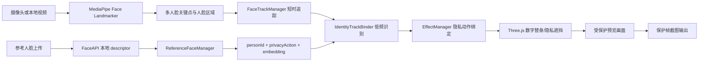
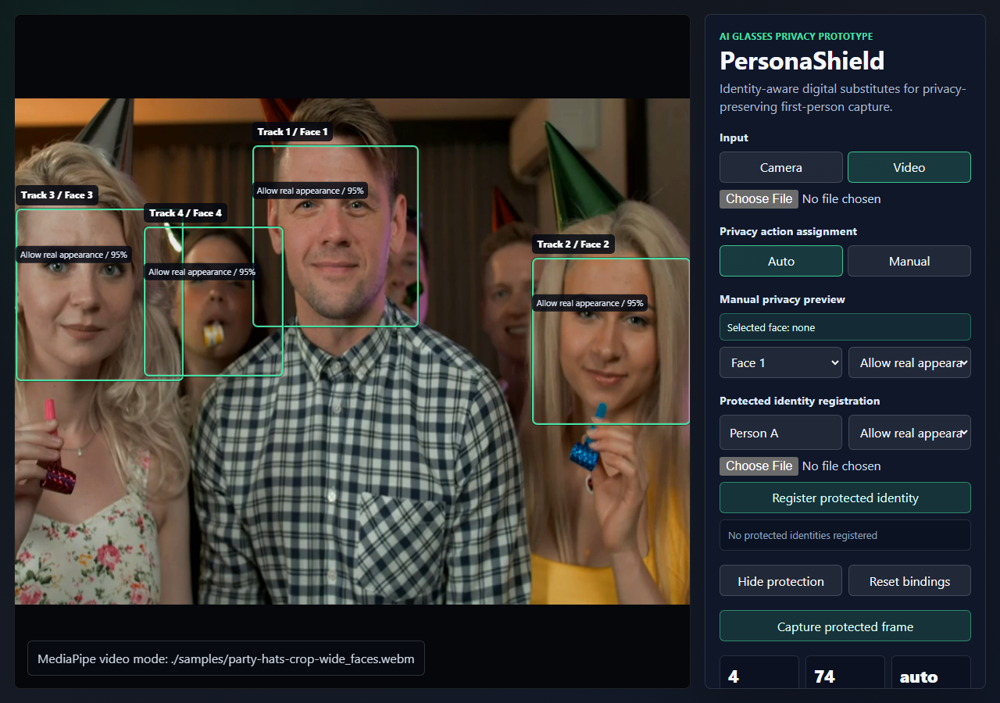

# PersonaShield 中文报告框架

## 题目建议

**基于数字替身的身份感知视频隐私防护原型**

副标题：**面向 AI 眼镜第一视角拍摄场景**

## 1. 项目背景

AI 眼镜和智能眼镜将摄像头集成在眼镜本体上，拍摄动作比手机更自然、更隐蔽。传统手机拍摄通常需要举起设备，被拍摄者更容易察觉；而第一视角眼镜拍摄可能让旁观者难以及时判断自己是否正在被记录。现有产品多依赖录制指示灯、权限提示或平台规则，但这些机制主要服务于拍摄者设备管理，较少体现被拍摄者对自身真实形象的主动控制。

本项目提出 PersonaShield 原型：被拍摄者可提前注册参考人脸、选择数字替身并设置隐私偏好；当合规拍摄端检测到已注册身份时，系统在本地预览和输出画面中将真实脸替换为数字替身或隐私遮挡。项目不声称阻止所有偷拍，而是验证一种“被拍摄者可声明、拍摄端可执行、结果可视化”的隐私保护机制。

## 2. 问题定义

给定若干注册身份和一段摄像头/本地视频输入，系统需要完成：

1. 用户上传参考人脸图像，注册受保护身份。
2. 用户为每个身份选择隐私动作：允许真实出镜、男性数字替身、女性数字替身或隐私遮挡。
3. 系统从参考图中本地提取人脸 descriptor，并保存 `{personId, privacyAction, embedding}`。
4. 系统在视频中检测 2-4 张人脸，并维护短时稳定的 `trackId`。
5. 当新 track 出现或身份不确定时，低频执行人脸识别匹配。
6. 如果匹配到注册身份，则建立 `personId -> trackId -> privacyAction` 绑定。
7. 后续帧依靠 track 追踪保持绑定稳定，并渲染对应数字替身或遮挡。
8. 生成可视化截图，证明最终保护画面不再只是原始视频。

## 3. 系统架构



系统采用纯前端静态网页实现。MediaPipe 负责人脸检测、关键点和 AR 锚点；FaceAPI 负责参考图和实时 track crop 的 128 维人脸 descriptor；IdentityTrackBinder 将识别结果绑定到短时 track；EffectManager 将原本的娱乐特效绑定扩展为隐私动作绑定。

## 4. 核心模块

- `MediaPipeFaceSource`：最多检测 4 张人脸，输出关键点、姿态和人脸区域。
- `FaceTrackManager`：将检测结果关联成稳定 track，处理短暂丢失、恢复和槽位交换。
- `FaceApiIdentityRecognizer`：加载本地 FaceAPI 模型，提取 128 维 descriptor 并计算距离。
- `ReferenceFaceManager`：保存注册身份、参考头像、隐私动作、avatar 类型和 descriptor。
- `IdentityTrackBinder`：负责 `personId -> trackId -> privacyAction` 的低频识别与绑定。
- `EffectFactory`：新增 `Allow real appearance`、男性数字替身、女性数字替身、隐私遮挡四类隐私动作。
- `UIController`：提供身份注册、隐私动作选择、点击选脸、track 状态和截图输出。

## 5. 检测、识别与追踪策略

浏览器端每帧做人脸识别会影响实时性，因此本项目采用分层策略：

1. 检测层：MediaPipe 周期性检测多张人脸。
2. 追踪层：根据屏幕位置、尺度和槽位维护稳定 track。
3. 识别层：只在新 track 或身份不确定时进行 FaceAPI descriptor 匹配。
4. 绑定层：匹配成功后建立身份到 track 的隐私动作绑定。
5. 渲染层：连续帧直接根据 track 绑定渲染数字替身，避免每帧重复识别。

该策略兼顾身份绑定稳定性和实时帧率。

## 6. 隐私动作设计

MVP 支持四种动作：

| 动作 | 含义 | 展示效果 |
| --- | --- | --- |
| Allow real appearance | 允许真实形象出镜 | 不遮挡 |
| Male digital substitute | 使用男性数字替身 | 头像式遮挡真实脸 |
| Female digital substitute | 使用女性数字替身 | 头像式遮挡真实脸 |
| Privacy blur shield | 隐私遮挡 | 马赛克/遮挡式保护 |

这四个动作对应课程演示中的核心产品价值：不同身份可以拥有不同隐私偏好，而不是对所有人脸统一处理。

## 7. 可视化结果

运行地址：

```text
http://127.0.0.1:8000/mediapipe-ar.html
```

关键截图：


图 1：注册 `Person A` 和 `Person B` 后，系统将两名已识别人物分别绑定到男性/女性数字替身；右侧显示参考头像、隐私动作、识别距离和 track 状态。


图 2：注册视频中不存在的 `Stranger` 后，当前视频中的活动人脸没有被错误绑定，证明系统具备负例拒绝能力。


图 3：点击画面中的某个 face box，手动将该 track 设置为 `Privacy blur shield`，证明系统支持人工指定受保护对象。



图 4：未注册身份时系统保持多人脸检测、track HUD 和实时 FPS 状态，默认不对陌生人乱加娱乐特效。

## 8. 验收标准

1. 可以注册至少 2 个受保护身份。
2. 每个身份可以上传 1 张参考人脸图像。
3. 每个身份可以选择男性数字替身、女性数字替身、隐私遮挡或允许真实出镜。
4. 视频中出现注册身份时，系统能自动绑定对应 track。
5. 两个注册身份同时出现时，能够展示不同数字替身或隐私动作。
6. 注册陌生参考图时，不应错误绑定到当前视频人脸。
7. 手动点击选脸后，可以为指定 track 设置隐私动作。
8. 保护帧截图输出应包含视频画面和隐私保护层。
9. 身份绑定开启后仍保持 24 FPS 以上的实时性。
10. 报告中包含架构图、运行界面截图、正例/负例测试结果和局限性分析。

## 9. 当前局限性

- 当前是本地 WebAR 原型，不接入真实 AI 眼镜硬件或 SDK。
- 人脸识别是身份匹配，不是法律意义上的身份认证。
- 单张参考图对姿态、光照和清晰度敏感。
- 对未接入协议或恶意设备无法强制执行隐私保护。
- 当前数字替身为基础几何头像，视觉效果仍可继续美化。
- 中心化注册方案存在信任问题，DID/去中心化身份暂作为未来方向，不纳入当前 MVP。

## 10. 后续工作

- 增加多张参考图融合，提高识别稳定性。
- 增加自定义数字替身编辑器。
- 加入录制受保护视频功能，而不仅是保护帧截图。
- 将 FaceAPI 识别迁移到 Web Worker。
- 引入更强的人脸识别模型，如 InsightFace/AdaFace/EdgeFace ONNX。
- 探索可信执行环境、隐私信号广播或 DID 作为远期协议方向。
